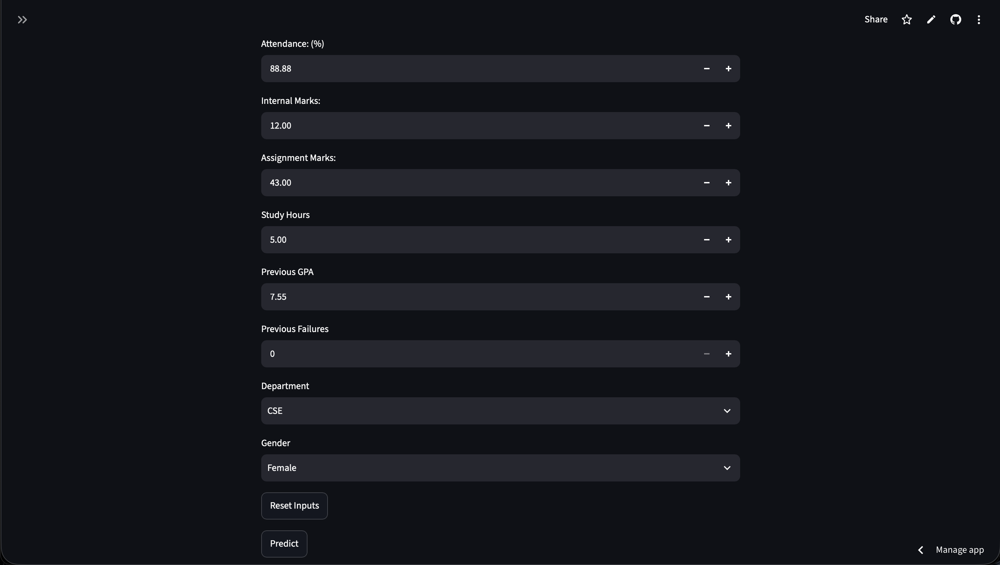
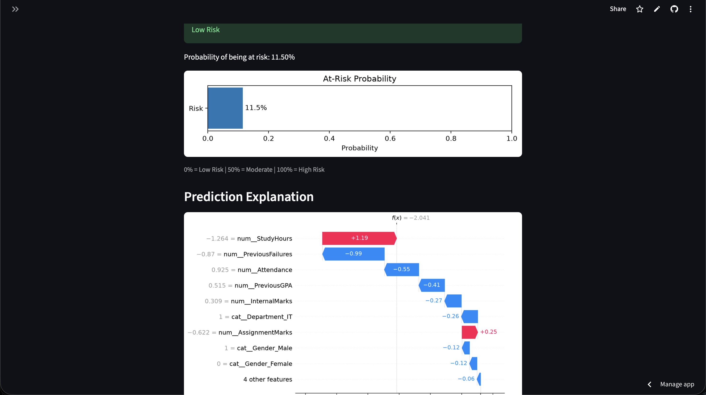
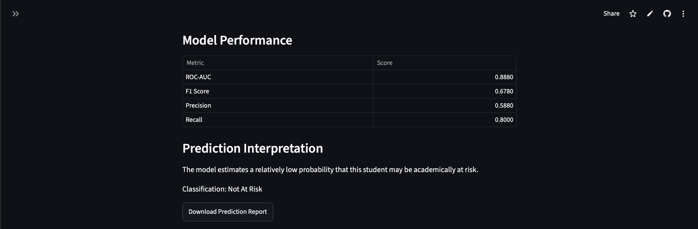
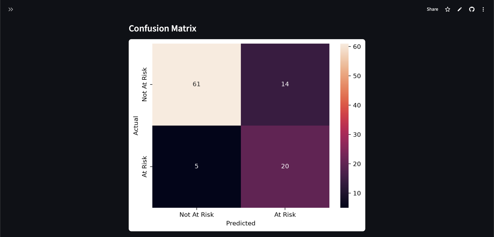
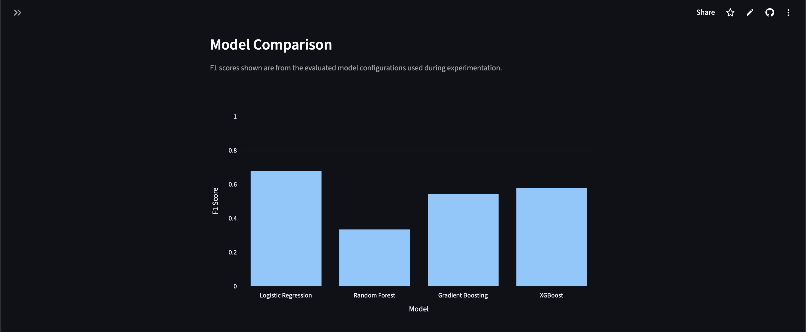
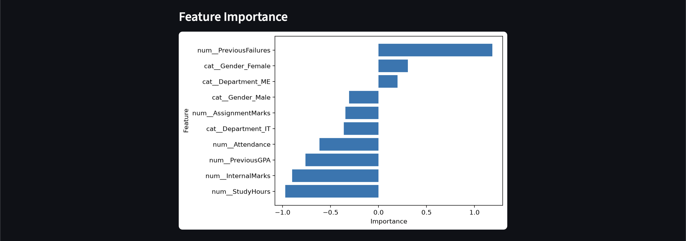
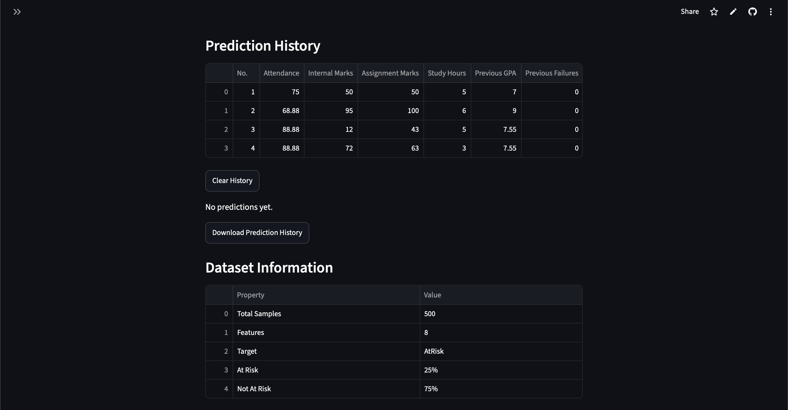

# Student At-Risk Prediction System

An end-to-end machine learning application for identifying students who may be academically at risk based on academic performance and student characteristics.

The project covers the complete machine learning lifecycle, from data preprocessing and exploratory analysis to model comparison, class-imbalance handling, explainability, and deployment as an interactive Streamlit application.

## Live Demo

https://student-at-risk-prediction-q9jmjetm2lncgw5zbkzpfl.streamlit.app


## Screenshots

### Student Prediction Interface



### Prediction Result



### Model Evaluation










### Prediction History



## Project Overview

The system analyzes student information such as attendance, internal marks, assignment marks, study hours, previous GPA, previous failures, department, and gender to estimate the probability that a student belongs to the **At Risk** class.

The application also provides model explanations using SHAP and allows users to review previous predictions and download prediction reports.

## Features

* Student academic-risk prediction
* Probability-based risk assessment
* Class-imbalance handling
* Multiple machine learning models
* Cross-validation
* Hyperparameter tuning
* Decision-threshold analysis
* ROC-AUC and F1-based evaluation
* Confusion matrix
* Feature importance analysis
* SHAP-based model explainability
* Individual prediction explanations
* Prediction history
* CSV prediction reports
* Trained-model download
* Interactive Streamlit interface
* Cloud deployment

## Machine Learning Workflow

```text
Data Collection
      ↓
Data Cleaning
      ↓
Exploratory Data Analysis
      ↓
Feature Engineering
      ↓
Data Preprocessing
      ↓
Model Training
      ↓
Model Comparison
      ↓
Cross-Validation
      ↓
Hyperparameter Tuning
      ↓
Class-Imbalance Handling
      ↓
Threshold Analysis
      ↓
Model Explainability
      ↓
Streamlit Application
      ↓
Cloud Deployment
```

## Dataset

The dataset contains **500 student records**.

### Input Features

| Feature          | Description                   |
| ---------------- | ----------------------------- |
| Attendance       | Student attendance percentage |
| InternalMarks    | Internal assessment marks     |
| AssignmentMarks  | Assignment performance        |
| StudyHours       | Average study hours           |
| PreviousGPA      | Previous academic GPA         |
| PreviousFailures | Number of previous failures   |
| Department       | Student department            |
| Gender           | Student gender                |

The target variable is:

```text
AtRisk
```

The dataset distribution is approximately:

* **75% — Not At Risk**
* **25% — At Risk**

### Target Leakage Prevention

`FinalMarks` was intentionally excluded from the prediction features because it represents information closely related to the academic outcome being predicted. Including it could introduce target leakage and produce an unrealistically optimistic model.

## Data Preprocessing

The preprocessing pipeline uses:

### Numerical Features

`StandardScaler` is applied to:

* Attendance
* Internal Marks
* Assignment Marks
* Study Hours
* Previous GPA
* Previous Failures

### Categorical Features

`OneHotEncoder(handle_unknown="ignore")` is applied to:

* Department
* Gender

The preprocessing and model are combined into a Scikit-learn `Pipeline` and `ColumnTransformer`.

## Models Evaluated

Several classification algorithms were evaluated:

* Logistic Regression
* Random Forest
* Gradient Boosting
* XGBoost

The models were compared using metrics including:

* Precision
* Recall
* F1 Score
* ROC-AUC
* Average Precision / PR-AUC
* Cross-validation F1

## Class Imbalance

The target distribution contains approximately 75% non-risk and 25% at-risk students.

To improve detection of the minority class, Logistic Regression was trained using:

```python
class_weight="balanced"
```

This increased the model's recall for at-risk students from the baseline configuration while maintaining a reasonable precision-recall balance.

## Final Model

The deployed application uses **Logistic Regression** with:

```text
StandardScaler
        +
OneHotEncoder
        +
Logistic Regression
        +
class_weight="balanced"
```

## Model Performance

Evaluation on the held-out test set:

| Metric    | Score |
| --------- | ----: |
| F1 Score  | 0.678 |
| Precision | 0.588 |
| Recall    | 0.800 |
| ROC-AUC   | 0.882 |

The model achieved a recall of approximately **80%**, meaning it identified a substantial proportion of the students belonging to the at-risk class in the test set.

Because this is a relatively small dataset, these results should not be interpreted as evidence of performance on a larger or different student population.

## Cross-Validation

Five-fold stratified cross-validation was used during model development.

Cross-validation was performed on the training data to estimate how consistently the models performed across different subsets of the data while keeping the final test set separate for evaluation.

## Hyperparameter Tuning

Hyperparameter tuning was performed using cross-validation.

Examples included:

* Logistic Regression `C`
* Random Forest number of estimators and maximum depth
* Gradient Boosting learning rate, depth, and estimators
* XGBoost learning rate, depth, and estimators

The tuned models were subsequently evaluated on the held-out test set.

## Decision Threshold Analysis

The project also investigated different probability thresholds for classifying students as at risk.

Instead of automatically using:

```text
Probability ≥ 0.50 → At Risk
```

multiple thresholds were evaluated to observe their effect on:

* Precision
* Recall
* F1 Score

This demonstrates how the classification threshold can affect the trade-off between identifying more at-risk students and reducing false positives.

## Model Explainability

SHAP (SHapley Additive exPlanations) is used to interpret the Logistic Regression model.

The analysis provides:

* Global feature influence
* Individual prediction explanations
* SHAP waterfall plots
* Feature contribution analysis

The analysis indicated that features such as previous failures, internal marks, study hours, previous GPA, and attendance had substantial influence on model predictions.

SHAP describes how the trained model uses these features; it does **not** establish that a feature directly causes academic risk.

## Streamlit Application

The deployed application allows users to enter student information and receive:

* Predicted risk classification
* Risk probability
* Risk category visualization
* SHAP explanation
* Model performance information
* Confusion matrix
* Feature importance
* Prediction history
* Downloadable prediction reports

## Project Architecture

```text
                    Student Input
                         ↓
                 Streamlit Interface
                         ↓
                  Input DataFrame
                         ↓
              Preprocessing Pipeline
              ↙                    ↘
      Numerical Features      Categorical Features
       StandardScaler          OneHotEncoder
              ↘                    ↙
                   Logistic Regression
                         ↓
                  Risk Probability
                         ↓
              ┌──────────┴──────────┐
              ↓                     ↓
       Risk Prediction        SHAP Explanation
              ↓
       Streamlit Results
```

## Technologies

* Python
* Pandas
* NumPy
* Scikit-learn
* XGBoost
* Matplotlib
* Seaborn
* SHAP
* Plotly
* Streamlit
* Joblib
* Git
* GitHub

## Repository Structure

```text
student-at-risk-prediction/
│
├── app.py
├── train_model.py
├── student_risk_model.pkl
├── X_train_transformed.pkl
├── X_test.pkl
├── y_test.pkl
├── student_statistics_v2.csv
├── requirements.txt
├── runtime.txt
├── README.md
└── .gitignore
```

## Running Locally

Clone the repository:

```bash
git clone https://github.com/jithendranshreyas-maker/student-at-risk-prediction.git
cd student-at-risk-prediction
```

Create a virtual environment:

```bash
python3 -m venv venv
source venv/bin/activate
```

Install dependencies:

```bash
pip install -r requirements.txt
```

Run the Streamlit application:

```bash
streamlit run app.py
```

## Limitations

* The dataset contains only 500 records.
* The dataset may not represent the broader student population.
* Model performance can change with different datasets and cohorts.
* The predictions represent statistical estimates rather than definitive academic outcomes.
* The risk categories shown in the application are application-level interpretations and are not validated academic intervention thresholds.
* SHAP explanations describe model behavior and should not be interpreted as causal relationships.

## Future Improvements

Potential extensions include:

* Larger real-world datasets
* More academic and behavioral features
* Semester-level performance tracking
* Subject-level predictions
* Time-series student performance analysis
* More advanced ensemble models
* External validation on another student cohort
* Improved probability calibration
* Automated model retraining
* Student performance dashboards

## Project Status

**Completed and deployed**

The project demonstrates an end-to-end machine learning workflow including data preparation, exploratory analysis, supervised learning, model evaluation, class-imbalance handling, hyperparameter tuning, explainability, application development, version control, and cloud deployment.
